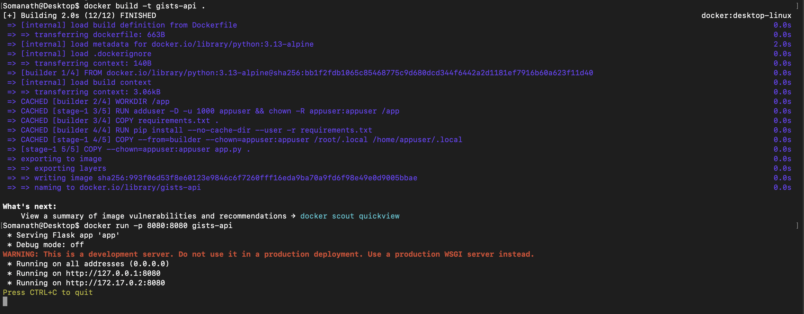
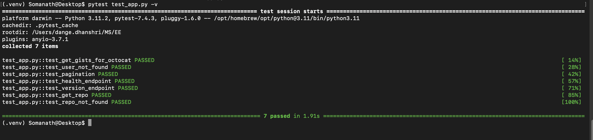
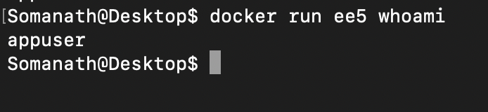
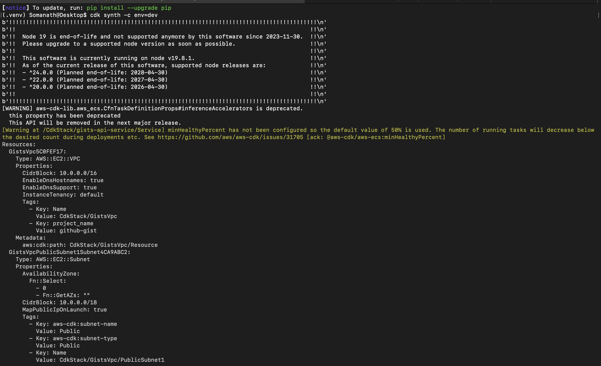
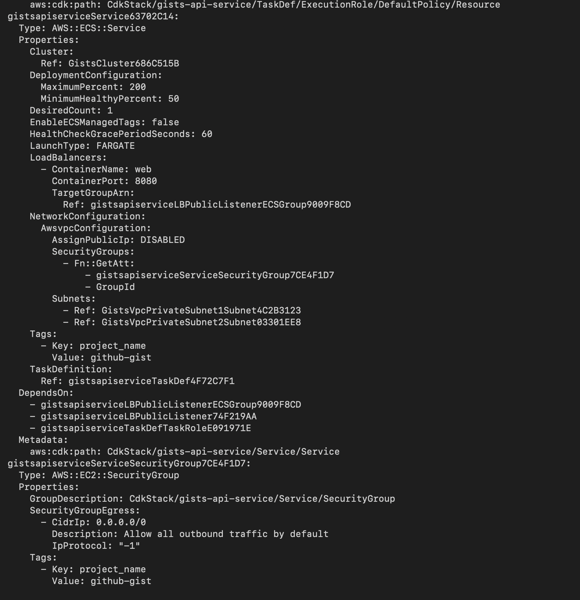

# GitHub Gists API

Simple web API that fetches public gists for any GitHub user and repository details.

## What it does

Fetch GitHub gists, repository info, and health status. Built with Flask, tested with pytest, runs in Docker.

## Quick Start

### Running locally

```bash
# Create virtual environment
python3 -m venv .venv

# Activate it
source .venv/bin/activate

# Install dependencies
pip install -r requirements.txt

# Run the app
python3 app.py
```

Then visit: 
    http://localhost:8080/octocat
    http://localhost:8080/health
    http://localhost:8080/version

### Running with Docker

```bash
docker build -t gists-api .
docker run -p 8080:8080 gists-api
```



Then visit: 
    http://localhost:8080/octocat
    http://localhost:8080/health
    http://localhost:8080/version


## Testing

```bash
pytest test_app.py -v
```



Tests cover:
- Getting gists for valid users (using octocat as test data)
- 404 handling for invalid users
- Response structure validation
- Pagination
- All API endpoints

## API Endpoints

### 1. Get User Gists

**Request:**
```
GET /<username>
```

**With Pagination:**
```
GET /<username>?page=2&per_page=10
```

Query parameters:
- `page` - Page number (default: 1)
- `per_page` - Results per page (default: 30)

**Response:**
```json
[
  {
    "id": "abc123",
    "description": "My cool gist",
    "url": "https://gist.github.com/abc123",
    "files": ["example.py", "readme.md"]
  }
]
```

**Examples:**
```bash
curl http://localhost:8080/octocat
curl "http://localhost:8080/octocat?per_page=5"
```

### 2. Get Repository Details

**Request:**
```
GET /<username>/<reponame>
```

**Response:**
```json
{
  "name": "Hello-World",
  "description": "My first repository",
  "url": "https://github.com/octocat/Hello-World",
  "stars": 1500,
  "forks": 800,
  "language": "JavaScript"
}
```

**Example:**
```bash
curl http://localhost:8080/octocat/Hello-World
```

### 3. Health Check

**Request:**
```
GET /health
```

**Response:**
```json
{"status": "healthy"}
```

### 4. Version Info

**Request:**
```
GET /version
```

**Response:**
```json
{"version": "1.0.0", "api": "GitHub Gists API"}
```

## Error Responses

- 404 - User/Repository not found
- 500 - GitHub API error

## Docker Notes

The Dockerfile uses:
- Multi-stage build to keep image size down
- Non-root user (appuser) for security
- Python 3.13 alpine base image (~50MB)

You can verify it runs as non-root:
```bash
docker run gists-api whoami
# appuser
```


## Files

- `app.py` - Main Flask application
- `test_app.py` - Automated tests
- `requirements.txt` - Python dependencies
- `Dockerfile` - Container setup
- `.dockerignore` - Keeps build context clean

## Requirements

- Python 3.13+ or Docker
- That's it

## Deploy to AWS

To deploy to AWS ECS Fargate, see the `cdk/` directory and `cdk/DEPLOY.md` for instructions.



## Troubleshooting

If port 8080 is taken:
```bash
docker run -p 9090:8080 gists-api
```

If tests fail, make sure deps are installed:
```bash
pip install -r requirements.txt
```
